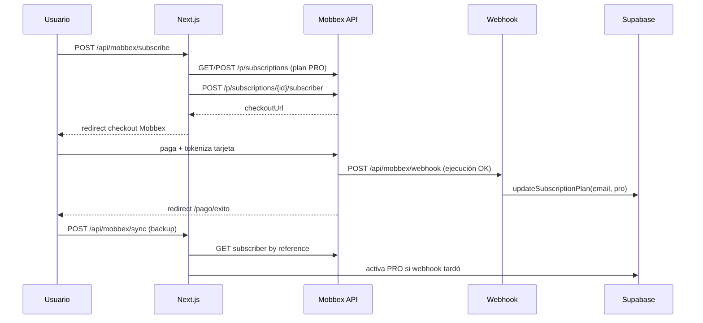

# Mobbex Subscriptions — Esquema técnico (SEO Jump)

Referencia para conectar el flujo de cobro PRO ($39.000 ARS/mes) en Next.js.
Docs oficiales: [mobbex.dev/suscripciones](https://mobbex.dev/suscripciones) · SDK: [github.com/mobbexco/nodejs](https://github.com/mobbexco/nodejs)

---

## 1. Modelo mental (vs Mercado Pago)

| Concepto MP | Concepto Mobbex | Notas |
|-------------|-----------------|-------|
| `preapproval_plan` | **Subscription** (plan) | Monto, intervalo, webhook del plan |
| `preapproval` (suscriptor) | **Subscriber** | Usuario + tarjeta tokenizada |
| Cobro mensual automático | **Execution** (ejecución) | Cada renovación dispara webhook |
| `external_reference` | `reference` en subscriber | Nosotros: `seojump\|pro\|email@...` |
| `init_point` / checkout | `url` del subscriber | Redirect del usuario |
| Webhook IPN | Webhook por ejecución | POST JSON a tu URL |

Mobbex tokeniza la tarjeta en **su checkout** (igual que MP): no manejamos PAN en SEO Jump.

---

## 2. Arquitectura en SEO Jump



---

## 3. API REST (base: `https://api.mobbex.com/p`)

Headers en **todas** las requests:

```
x-api-key: {MOBBEX_API_KEY}
x-access-token: {MOBBEX_ACCESS_TOKEN}
Content-Type: application/json
```

Respuesta estándar:

```json
{
  "result": true,
  "data": { ... }
}
```

### 3.1 Subscriptions (planes)

| Método | Path | Uso en SEO Jump |
|--------|------|-----------------|
| `GET` | `/subscriptions` | Listar planes; buscar "SEO Jump — Plan PRO" |
| `POST` | `/subscriptions` | Crear plan PRO si no existe |
| `GET` | `/subscriptions/{id}` | Debug / admin |
| `POST` | `/subscriptions/{id}` (edit) | Cambiar precio (futuro) |

**Body crear plan PRO** (ya en `getProSubscriptionId()`):

```json
{
  "total": 39000,
  "currency": "ARS",
  "name": "SEO Jump — Plan PRO",
  "description": "Suscripción mensual PRO — SEO Jump",
  "type": "dynamic",
  "interval": "1m",
  "trial": 0,
  "limit": 0,
  "webhook": "https://seo-jump.ai/api/mobbex/webhook",
  "return_url": "https://seo-jump.ai/pago/exito",
  "test": false
}
```

- `type: "dynamic"` — permite ajustar monto por suscriptor si hiciera falta.
- `interval: "1m"` — mensual.
- `trial: 0` — sin días gratis.
- `limit: 0` — sin tope de cobros (0 = ilimitado en Mobbex).
- `webhook` — **por ejecución** (cada cobro mensual).
- `return_url` — a dónde vuelve el usuario post-checkout.

### 3.2 Subscribers (suscriptores)

| Método | Path | Uso en SEO Jump |
|--------|------|-----------------|
| `POST` | `/subscriptions/{id}/subscriber` | **Checkout** — crea suscriptor + URL |
| `GET` | `/subscriptions/{id}/subscriber?page=N` | Sync backup — buscar por `reference` |
| `GET` | `/subscriptions/{id}/subscriber/{sid}` | Detalle estado |
| `POST` | `.../subscriber/{sid}/suspend` | Cancelación (futuro) |
| `POST` | `.../subscriber/{sid}/activate` | Reactivar (futuro) |

**Body crear suscriptor** (ya en `createProSubscriptionCheckout()`):

```json
{
  "customer": {
    "email": "usuario@gmail.com",
    "name": "Nombre Google",
    "identification": "00000000"
  },
  "reference": "seojump|pro|usuario@gmail.com",
  "startDate": { "day": 18, "month": 6 }
}
```

Respuesta clave: `data.url` (link de checkout) y `data.uid` (subscriber ID).

### 3.3 Executions (ejecuciones — renovaciones)

No las llamamos desde Next.js en el flujo normal. Mobbex las corre solo y avisa por **webhook**.

Operaciones admin (consola o API futura): retry, manual execution, mark paid.

---

## 4. Webhooks

- URL configurada en el **plan** al crearlo: `https://seo-jump.ai/api/mobbex/webhook`
- Método: `POST`, body JSON
- Tu server debe responder **HTTP 200** siempre que procese (aunque ignore el evento)
- Mobbex puede firmar con HMAC (ver [mobbex.dev/webhooks](https://mobbex.dev/webhooks)) — validación opcional fase 2

**Handler actual** (`handleMobbexWebhook`):

1. Extrae `reference` del payload (`payment.reference` o `data.reference`)
2. Parsea `seojump|pro|email`
3. Si status code ∈ `{200, 3, 100, approved, paid}` → `updateSubscriptionPlan(email, 'pro')`
4. Si status ∈ cancelación/suspensión → `updateSubscriptionPlan(email, 'free')`

> Mañana al primer pago real: loguear el body completo en Vercel y ajustar códigos si difieren.

---

## 5. Mapa de funciones (ya implementadas)

| Función | Archivo | Rol |
|---------|---------|-----|
| `getMobbexCredentials()` | `src/lib/mobbex.ts` | Lee env vars |
| `getMobbexCallbackBaseUrl()` | idem | Localhost → `seo-jump.ai` |
| `buildExternalReference()` | idem | `seojump\|plan\|email` |
| `getProSubscriptionId()` | idem | Env ID o crear/buscar plan |
| `createProSubscriptionCheckout()` | idem | **Flujo principal checkout** |
| `getSubscriber()` | idem | Consulta estado |
| `syncProSubscriptionForEmail()` | idem | Backup post-`/pago/exito` |
| `handleMobbexWebhook()` | idem | Activa/baja PRO |
| `getMobbexAccountHealth()` | idem | Diagnóstico credenciales |

### Rutas Next.js

| Ruta | Método | Auth |
|------|--------|------|
| `/api/mobbex/subscribe` | POST | Sesión Google |
| `/api/mobbex/webhook` | POST | Público (Mobbex) |
| `/api/mobbex/sync` | POST | Sesión Google |
| `/api/debug-mobbex` | GET | Diagnóstico (dev) |

### UI

| Componente | Rol |
|------------|-----|
| `SubscribeProButton.js` | Llama subscribe → redirect |
| `pago/exito/page.js` | Poll sync hasta activar PRO |
| `pago/pendiente/page.js` | Pago en proceso |

### Supabase (sin cambios)

`updateSubscriptionPlan(email, plan, expiresAt)` — misma función que con MP/Stripe.

---

## 6. Variables de entorno

```bash
MOBBEX_API_KEY=           # Consola → Developer / API Key
MOBBEX_ACCESS_TOKEN=      # Consola → Entidad → Access Token
MOBBEX_SUBSCRIPTION_ID=   # Opcional: fijar plan ya creado
MOBBEX_TEST=true          # Opcional: plan en modo test
NEXTAUTH_URL=https://seo-jump.ai
```

**Quitar de Vercel:** `MP_ACCESS_TOKEN`, `MP_WEBHOOK_SECRET`, `MP_PUBLIC_KEY`.

---

## 7. Checklist mañana (≈ 5 minutos)

1. Consola Mobbex habilitada → copiar API Key + Access Token
2. Pegar en `.env.local` y en Vercel → **Redeploy**
3. Abrir `https://seo-jump.ai/api/debug-mobbex` (o `localhost:3000/api/debug-mobbex`)
   - Debe devolver `"ok": true` y `"credentials": true`
4. Login → `/precios` → **Quiero PRO — Mobbex**
5. Pagar con tarjeta test ([medios de prueba](https://mobbex.dev/medios-de-pago-para-pruebas))
6. Verificar PRO en `/perfil`
7. Si PRO no activa: logs Vercel en `/api/mobbex/webhook` y ajustar códigos de status

---

## 8. Funciones futuras (no bloquean el lanzamiento)

```typescript
// Cancelar suscripción (usuario desde perfil o soporte)
async function suspendMobbexSubscriber(subscriptionId: string, subscriberId: string)

// Validar firma HMAC del webhook
function verifyMobbexWebhookSignature(body: string, signature: string): boolean

// Webhook de renovación mensual — extender expiresAt +35 días
// (hoy el webhook ya re-activa PRO en cada cobro exitoso)
```

---

## 9. Diferencias importantes vs MP

| Tema | MP (viejo) | Mobbex (nuevo) |
|------|------------|----------------|
| Alta comercial | `billing.allow` bloqueaba | CUIT + revisión Mobbex |
| Email pagador | Debía coincidir con cuenta MP | Solo email en `customer.email` |
| Localhost | MP rechazaba back_url | Igual — usamos `seo-jump.ai` en callbacks |
| SDK | No usábamos | Usamos `fetch` directo (sin npm `mobbex`) |
| Renovaciones | Webhook preapproval | Webhook por **ejecución** mensual |

---

*Última actualización: Junio 2026*
